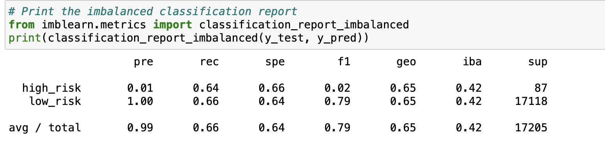
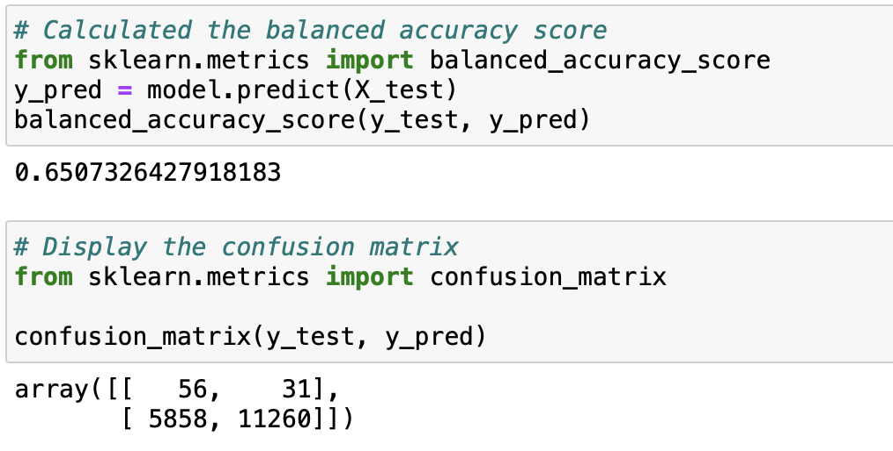
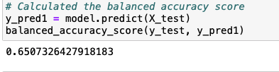
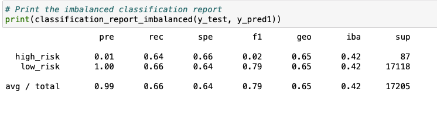

# Credit Risk Analysis
## Overview
Loans are an integral part of modern society. It presents opportunities and poses a serious challenge for banks. It creates revenues with interest rate generated, and other hand, people default payment, thus, makes a loss of revenues. However, machine learning can be used to analyze large datasets to predict risk and inform the decision to approve loan application or reject it.

Usually, banks traditionally rely on income, credit scores, and collateral assets to assess lending risk. The challenge is that many data can be left out, which could have aided the lending decisions. In this project, I used the credit card dataset from LendingClub, a peer-to-peer lending services company, for the analysis. 

I used Python and Scikit-learn libraries to build algorithms and predict credit risk. I finally evaluate the following machine learning models:
- Naive Random Oversampling
- SMOTE Oversampling
- Undersampling
- SMOTEENN
- Balanced Random Forest Classifier
- Easy Ensemble AdaBoost Classifier.

I then compared their strengths and weaknesses to assess how well each models works to classify and predict the risks.
## Results
1. Naive Random Oversampling models:

- the balanced accuracy score is 0.65

- The precision score for high risk is 0.01 while the precision score for low risk is 1.0. The recall score for high risk is 0.64 while low risk is 0.66
2. SMOTE Oversampling model

## Summary
