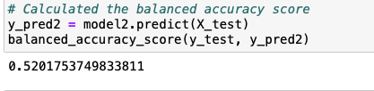
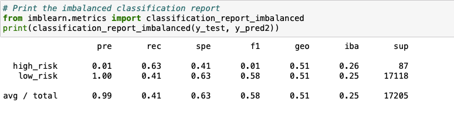
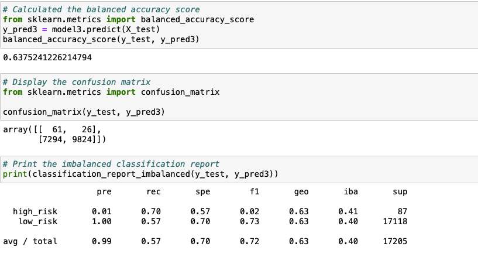
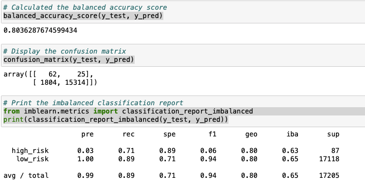
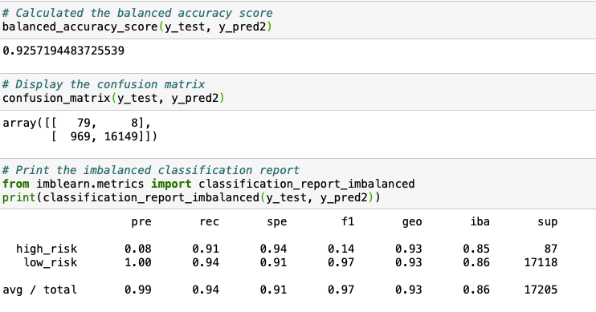

# Credit Risk Analysis
## Overview
Loans are an integral part of modern society. It presents opportunities and poses a serious challenge for banks. It creates revenues with interest rate generated, and other hand, people default payment, thus, makes a loss of revenues. However, machine learning can be used to analyze large datasets to predict risk and inform the decision to approve loan application or reject it.

Usually, banks traditionally rely on income, credit scores, and collateral assets to assess lending risk. The challenge is that many data can be left out, which could have aided the lending decisions. In this project, I used the credit card dataset from LendingClub, a peer-to-peer lending services company, for the analysis. 

I used Python and Scikit-learn libraries to build algorithms and predict credit risk. I finally evaluate the following machine learning models:
- Naive Random Oversampling
- SMOTE Oversampling
- Undersampling
- SMOTEENN
- Balanced Random Forest Classifier
- Easy Ensemble AdaBoost Classifier.

I then compared their strengths and weaknesses to assess how well each models works to classify and predict the risks.
## Results
#### 1. Naive Random Oversampling models:

- the balanced accuracy score is 0.65

- The precision score for high risk is 0.01 while the precision score for low risk is 1.0. The recall score for high risk is 0.64 while low risk is 0.66

#### 2. SMOTE Oversampling model
- 
- The balance accuracy score for this model is 0.65

- The precision score is 0.01 and 1.0 for high risk and low risk respectively. While the recall score is 0.64 and 0.66 for high risk and low risk respectively.
#### 3. Undersampling model

- the balanced accuracy score for this model is 0.52

- The precision score is 0.01 and 1.00 for high risk and low risk respectively. While the recall is 0.63 and 0.41 for high risk and low risk respectively
#### 4. SMOTEENN ( the combination of Over and Under Sampling) model

- From this model, the balance accuracy score is 0.637, the precision score for high risk and low risk are 0.01 and 1.00 respectively. While the recall scores are 0.70 and 0.57 respectively. 
#### 5. Balanced Random Forest Classifier

- The balance accuracy score from this model is 0.80
- The precision scores are 0.03 and 1.00 for high risk and low risk respectively. While the recall scores for high risk and low risk are 0.71 and 0.89 respectively.
#### 6. Easy Ensemble AdaBoost Classifier

- The balance accuracy score from this model is 0.925
- The precision score for high risk and low risk are 0.08 and 1.00 respectively. While the recall score for high risk and low risk are 0.91 and 0.94 respectively.
## Summary
- Naive Random Oversampling and SMOTE Oversampling models produced the same results.
- Undersampling produced lower balanced accuracy score and F1 score than oversampling. However both under sampling and oversampling produced high precision scores for low risk.
- The combination of oversampling and undersampling produced a slight improvement over the balanced accuracy score, but, low f1 score on high risk.
- Balanced Random Forest Classifier produced a higher balanced accuracy score above the resampling models. However, with lower high risk f1 scores.
- Easy Ensembler has more higher balanced accuracy score and  recall scores but lower high risk f1 score.

Generally, all the models precisions for high risks are low indicating a large number of false positive which means an unrelaible positive classifications.
The recalls by combination over and undersampling are relatively low for low risks which indicate a large number of false negative.
In other words, the undersampling, oversampling and SMOTEENN models would not be the best one for predicting credit risk because the models accuracy scores are below 0.66 and F1 scores are not good enough to state that the model will be good at classifying high risk loan applications.

However, Balanced Random Forest Classifier and Ensembler models are good at predicting the risks but not good at classifying. Therefore, I will not recommend any of these models to predict because none of this model predict the high risk credit effectively. If I model can effectively predict the high risk, it would be risky to rely on that model for decision making.
